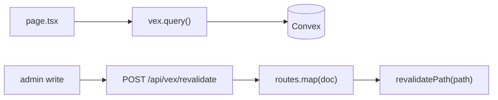
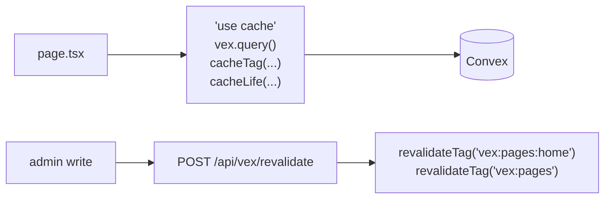

# Full Next.js cache control via `cacheComponents` + tags

**Date:** 2026-09-06 · **Status:** assessed, deferred — not started
**Related spec:** `2026-09-04-seo-prerendering-and-lifecycle-hooks` (shipped; this is its follow-on)
**Backlog entry:** `.agent/docs/product/backlog.md` → "Tag-based cache control"

## Question

The shipped revalidation feature gives path-based invalidation only. Can vexcms
expose the *full* Next.js cache surface — tags, configurable lifetimes,
`'use cache'` — and what would that cost?

## Answer

Yes, and the blocker list is short and fully enumerated (measured, not
estimated — see Evidence). The cost is a **medium lift, ~2–3 days**, but the
risk is not in the code: `cacheComponents` is an **app-wide** switch that also
enables Partial Prerendering, so it changes how every route renders — including
the entire admin panel. It deserves its own spec and its own gates rather than
being folded into a caching change.

## What we have today vs what Next 16.3.3 offers

Verified against `node_modules/next/cache.d.ts` — all of these are **stable**
exports, no `unstable_` prefix.

| Primitive | Used today |
| --- | --- |
| `revalidatePath` | ✅ the whole feature |
| `revalidateTag` / `cacheTag` / `updateTag` | ❌ |
| `cacheLife` | ❌ |
| `'use cache'` directive | ❌ |
| `unstable_cache` / `unstable_noStore` / `refresh` | ❌ |

**Why tags matter.** Path-only means `routes.map` must know every URL that
renders a document. That holds for `pages` (one document, one path) and breaks
for anything where the relationship is not one-to-one:

- a category or index listing that renders many documents
- a nav or footer built from a collection
- a "related posts" widget on pages the written document has no knowledge of

Tags invert the dependency: the **page** declares what data it read, and
invalidation names the *data* rather than enumerating URLs.

## The finding that changes the design

**`cacheComponents` forbids `export const revalidate`.** Measured:

```
Error: Route segment config "revalidate" is not compatible with
`nextConfig.cacheComponents`. Please remove it.
> 16 | export const revalidate = 3600
```

That is the exact constraint that forced `revalidateSeconds` out of
`VexRoutesConfig` during the parent spec — Next reads segment config by static
analysis before any module executes, so no config value could ever reach it.

Under `cacheComponents`, lifetime becomes a **runtime call** —
`cacheLife({ stale, revalidate, expire })` — so it *can* come from
`vex.config.ts`. Adopting `cacheComponents` gives back the cache config that is
impossible today.

## Evidence — measured blockers

Method: set `cacheComponents: true` in `apps/www/next.config.ts`, run
`pnpm build`, fix forward, repeat until no new class of error appeared. All
changes were reverted afterwards; only the `Math.random()` fix was kept.

| # | Blocker | Scope | Remedy |
| --- | --- | --- | --- |
| 1 | `Route segment config "dynamic"/"revalidate"/"runtime" is not compatible with cacheComponents` | 7 exports across 6 files | Delete them; lifetime moves to `cacheLife()` |
| 2 | `During prerendering, cookies() rejects when the prerender is complete` at `/admin/[[...path]]` — `getCurrentUser()` swallows the rejection | 1 call path (`src/auth/serverUtils.ts`) | `<Suspense>` around the user-dependent subtree; stop catching the rejection |
| 3 | `Math.random()` in `SidebarMenuSkeleton` | 1 line, ours | **DONE** — `packages/react/src/components/ui/sidebar.tsx` now derives width from `React.useId()` |
| 4 | `Math.random()` inside Convex's own React client (`convex/dist/react.bundle.js`), reached via `ConvexClientProvider` in the root layout | 1 boundary | `<Suspense>` around the Convex provider — Next's own documented remedy |

Blockers 3 and 4 surface only on `/_not-found`, which inherits the root layout,
and both report as:

```
Error: Route "/_not-found": Next.js encountered the unstable value
`Math.random()` in a Client Component.
  - [stream] Wrap the Client Component in `<Suspense fallback={...}>`
```

Nothing here requires an architectural rewrite.

## Proposed implementation

### Today — no cache identity, invalidated only by path



### With tags — the read declares its identity



Three additions:

**1. A cached read client** — `createVexCachedClient`, sibling to
`createVexServerClient` in `@vexcms/next/cache`. Each query wraps in
`'use cache'`, derives a tag from the function reference plus its args, and
applies `cacheLife` from config:

```ts
// tags: "vex:pages:getBySlug:{slug:'home'}" and "vex:pages"
const page = await vex.cached.query(api.pages.getBySlug, { slug: "home" })
```

Note `'use cache'` wraps *any* async work, not just `fetch` — so Convex reads
can be tagged without Convex exposing fetch options. This is what makes the
whole approach viable.

**2. Real cache config** — possible because `cacheLife` is a runtime call:

```ts
cache: {
  life: { stale: 300, revalidate: 3600, expire: 86_400 },
  perCollection: { pages: { revalidate: 60 } },
}
```

**3. A tag branch in the route** — `resolveTargets` already returns
`{ paths, errors }`; add `tags`, and have the handler call `revalidateTag`
alongside `revalidatePath`. `routes.map` is unchanged: path purging stays
correct for URLs that *can* be enumerated, and the two mechanisms compose.

## Cost and risk

**Cost: ~2–3 days.** One day for the four blockers plus Suspense boundaries; one
day for the cached client, tag derivation, config, and tests; half a day for
templates and docs.

**Risk: `cacheComponents` is app-wide and cannot be adopted per route.** It also
switches on Partial Prerendering, inverting the mental model from "static by
default, opt out with `dynamic`" to "dynamic by default, opt in with
`'use cache'`". The admin panel is entirely cookie-driven, so it becomes a
prerendered shell with dynamic content streamed in. That is a behavioural change
to the surface users spend all their time in, and it must be verified on its own
terms.

**Recommendation.** Keep this separate from the shipped spec. Tags are purely
additive — nothing about `routes.map` or the revalidate route has to change to
add them later — so there is no cost to waiting and a real cost to smuggling a
PPR migration in behind a caching feature.

## Open questions

- Does Convex's WebSocket subscription in `PageContent` interact badly with PPR
  streaming, or is it unaffected because it mounts client-side after hydration?
- Should tag derivation be automatic (hash of function reference + args) or
  explicit per collection? Automatic is zero-config but produces opaque tags
  that are hard to purge by hand from the dashboard.
- `updateTag` vs `revalidateTag`: `updateTag` expires immediately for the
  current request. Worth checking whether it gives the admin panel a
  read-your-own-writes guarantee that the current fire-and-forget purge cannot.

## Sources

- `node_modules/next/cache.d.ts` — the full stable cache surface, incl. every
  `cacheLife` profile
- `node_modules/next/dist/server/config-shared.d.ts:1529-1539` —
  `cacheComponents` docs: enables `use cache`, `cacheLife`, `cacheTag`, and PPR
- Build output of `apps/www` with `cacheComponents: true` — the blocker table
  above
- `convex/dist/react.bundle.js`, `better-auth/dist/client/session-refresh.mjs` —
  third-party `Math.random()` call sites
