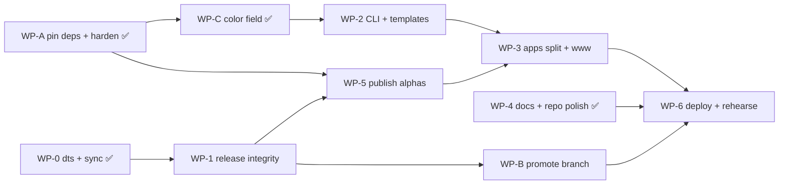

# Launch Readiness — Convex Meetup (Tue 2026-09-02)

Two working days (Sat 08-30, Sun 08-31), Mon 09-01 as buffer. Execution is
LLM-driven and parallelizable; this doc is the plan agent specs get written from.
**WP-0, WP-A and WP-C are implemented.** Everything else is plan.

## Objective

Four things to be able to do in person:

1. "`npm i @vexcms/core@alpha`" — works, **with types**.
2. "This site is built on VexCMS, running the published packages" — open the
   read-only admin panel on the deployed site.
3. "Here's the roadmap and what shipped" — rendered by VexCMS blocks.
4. "Here's what I'd want from Convex" — a specific, considered asks list.

Anything not serving one of those four is out of scope this weekend.

## Decisions taken (2026-08-30)

| # | Decision | Rationale |
| --- | --- | --- |
| D1 | **Skip the auth upgrade.** Stay on `better-auth` 1.6.23 / `@convex-dev/better-auth` 0.11.5 + existing patch. | 1.7.x is unreachable (peer wall). Current combo works. Re-authoring the routing patch is the risk, not the versions. |
| D2 | **Pin `dependencies` exact + bound the catalog; keep `peerDependencies` as ranges.** Enable `minimumReleaseAge`. | Supply-chain hardening. `^1.5.0` silently resolves to **1.7.2**. But 3 of core's peers are *already* accidentally exact and would break consumers. See WP-A. |
| D3 | **Read-only admin via `anonRole`**, not the anonymous plugin. | Already shipped; faster; demos RBAC. |
| D4 | **Hybrid deps** — `workspace:*` during dev, flip `apps/www` to `@alpha` for the deploy commit. | The flip is the proof the published tarballs work. |
| D5 | **Analytics: script tag now; adapter roadmapped under *Exploring*.** | Adapters are already the established extension mechanism — see WP-7. |
| D6 | **Promote `rebuild` → `master`, demote old master → `master-v0`.** | Verified a clean fast-forward. See WP-B. |
| D7 | **Rename `apps/www` → `apps/test`** (the sandbox), then generate the real `apps/www` from the marketing template. | Developer preference. |
| D8 | **Build `color` only. `ui`, `tabs`, `richtext`, `json` all CUT.** Preceded by the exhaustiveness fix (WP-C step 1). **Amended during WP-C:** the "simplified 7-field `themes.ts`" clause is superseded — themes carry the full shadcn 32-token set × light/dark (via `group`; `ui`/`tabs`/`richtext`/`json` stay cut). A 4-field theme cannot be applied globally: `--background` moves without `--foreground` and breaks contrast. | Measured template usage: color 57 call sites, ui 3, tabs 1, richtext **0**. `ui`/`tabs` change core invariants; `color` is a leaf field. See WP-C. |
| D9 | **Licence: Apache-2.0.** | Matches the `convex` npm package (verified `npm view convex license`). SPDX-valid, OSI-approved, badges cleanly. FSL covers only `convex-backend`, which has no VexCMS analogue. See WP-1. |

---

## Verified state (inspected 2026-08-30, not assumed)

| Fact | Evidence |
| --- | --- |
| Build / typecheck / tests green | 933 tests pass; typecheck 7/7 |
| 11 field types exist | `text number checkbox select date url relationship upload array group blocks` |
| README advertises 13, 4 fictional | `imageUrl` `richtext` `json` `ui`; omits `group` + `url` |
| Declarations never shipped | `dts: false` in all 7 tsup configs — **FIXED, WP-0** |
| `pnpm version:packages` crashed | `sync-template-versions.mjs` read nonexistent `packages/create-cli/templates` — **FIXED, WP-0** |
| Live scaffolder templates empty | `templates/{base-nextjs,marketing-site}/` hold only a README stub |
| Scaffolder tests falsely green | `integration.test.ts` guards every case with `if (!fs.existsSync(...)) return;` |
| `cli` runs zero tests | `No test files found`; its one test file is excluded from typecheck *and* unmatched by vitest |
| `catalog:` breaks under npm | `npm pack` keeps `"nanoid": "catalog:"`; `pnpm pack` resolves it. **Publishing must go through pnpm.** ✅ WP-A ships `scripts/check-packed-manifests.mjs --packed`, which fails on any unresolved `catalog:`/`workspace:` in a packed manifest — WP-1 step 4 should call it rather than write a second script |
| `docs` would publish to npm | `apps/docs/package.json` named `docs`, not private, not changeset-ignored |
| Not in prerelease mode | no `.changeset/pre.json` |
| No LICENSE despite README | README claims "MIT Licensed. Free forever." |
| Auth catalog is unbounded upward | `better-auth: ^1.5.0` resolves to **1.7.2**; only the lockfile pins 1.6.23. ✅ **Fixed by WP-A** — catalog now pins `better-auth: 1.6.23` exactly, and `catalogs.peers` publishes `">=1.6.23 <1.7.0"` so the 1.7.x peer wall is expressed rather than accidental |
| Auth peers already mismatched | `@convex-dev/better-auth@0.11.5` peers `>=1.5.0 <1.6.0`; installed is 1.6.23. Masked by `strict-peer-dependencies=false`. Works today. **Update 08-30:** now scoped to a single `allowedVersions` entry instead of a repo-wide suppression — strict peers verified passing (WP-A step 6). 0.12.5 peers `>=1.6.11 <1.7.0`, which 1.6.23 already satisfies |
| `rebuild` is a fast-forward of `master` | `master-only: 0`, `rebuild-only: 66`; `git merge-base --is-ancestor master rebuild` → true |
| Only 2 config refs to `master` | `.changeset/config.json:19`, `.github/workflows/release.yml:6` |
| Adapters are the existing extension pattern | core exports `VexAuthAdapter`, `VexStorageAdapter`, `StorageAdapterProtocol`; react exports `StorageAdapterContextProvider`; `@vexcms/file-storage-convex` is a concrete adapter |
| master has CLI + templates to reclaim | `packages/cli` 23 files; `create-cli` 177 files (159 templates) |

### Master-branch assets worth reclaiming

`.rebuild/reference/create-vexcms-templates/` is byte-identical to master's
templates (103 + 56 files) — no git checkout needed.

The marketing template already has **Roadmap** and **HowItWorks** blocks, a
theme system, live-preview routes, and a seed script, using a colocated
`blocks/<Name>/{config.ts,index.tsx}` layout (definition + renderer together).
That is better than rebuild's single giant `switch` in `PageContent.tsx`.
**Adopt the colocated layout.**

### API deltas when porting master → rebuild

| master | rebuild | note |
| --- | --- | --- |
| `object({ fields })` | `group({ fields })` | `object` doesn't exist |
| `select({ defaultValue: "x" })` | `defaultValue: ["x"]` | array-wrapped |
| `@vexcms/ui` | `@vexcms/react` | renamed |
| `@vexcms/admin-next` | `@vexcms/next` | renamed |
| `@vexcms/richtext` | `@vexcms/richtext-plate` | renamed |
| `admin.blockStyles` | *(none)* | strip |
| `RenderBlocks` | *(none)* | must be written (WP-2) |
| `imageUrl` `color` `tabs` `ui` `richtext` | *(none)* | strip / substitute |
| `defineBlock({ name })` | optional | `name?: string` |

---

## Non-goals

- Enterprise/BSL features and pricing — not mentioned on the site at all.
- `richtext` as a core field factory. Prose stores markdown in `text()`. (D8)
- **`ui` and `tabs` fields** (D8). Both change core invariants rather than adding
  a leaf: `ui` is non-persisted and must be skipped by schema generation, form
  validation, *and* column generation; `tabs` hoists child fields to the parent.
  Consequence for WP-2: the template uses `group` where master used `tabs`, and
  drops the 3 `ui()` call sites (the theme-import affordance) entirely.
- Per-instance custom **admin** field components (`admin.components.Field`).
  Front-end block renderers are ordinary React and are unaffected — see WP-3.
- Versioning/drafts. Spec exists; not credible in two days.
- Rewriting the docs site. De-boilerplate only.
- **better-auth 1.7.x** and **any auth version bump** (D1).
- Building an analytics adapter now (D5).

---

## Dependency graph



**Hard ordering constraint:** `WP-B` must come *after* `WP-1`. `release.yml`
fires on push to `master`, so promoting before WP-1 lands triggers a release that
would attempt to publish `docs`, skip prerelease mode, and clobber the `latest`
dist-tag.

---

## WP-0 — Type declarations + release script ✅ DONE

The `dts: false` comment ("Temporarily disable DTS to fix CPU issue") was
misleading. Real cause: the shared base tsconfig sets
`customConditions: ["source"]`, so `tsc` resolved `@vexcms/core` to core's
*source*, pulling sibling files outside `rootDir` (TS6059).

- `build` is now `tsup && tsc -p tsconfig.build.json --emitDeclarationOnly` in
  all 7 packages (`tsc` second — 6 tsup configs set `clean: true`).
- Every `tsconfig.build.json` sets `"customConditions": []` so workspace deps
  resolve via their published `types`. Turbo's `dependsOn: ["^build"]` ensures
  upstream `dist/` exists first.
- Added `tsconfig.build.json` for `react`, `richtext-plate`; test excludes for
  `cli`, `next`, `better-auth`, `file-storage-convex`.
- Exported `AuthFieldMeta` from core; removed `better-auth/src/adapter.ts`'s
  hardcoded `../../core/src/auth/types` import — would have shipped broken types.
- Fixed `scripts/sync-template-versions.mjs`: corrected path, and it now derives
  the package list from the workspace instead of a hardcoded list (the hardcoded
  one silently rotted through the rebuild renames).

Verified: 13/13 `types` targets resolve, 357 `.d.ts` emitted, 933 tests pass,
and a packed tarball in a scratch project typechecks clean **and** rejects
`text({ required: "yes-please" })` with `TS2322` — proving live inference rather
than silent `any`.

Needs a changeset before release.

---

## WP-A — Dependency pinning & supply-chain hardening ✅ DONE

Implemented 2026-08-30 in 7 task groups — spec:
`.agent/docs/specs/2026-08-30-wpa-dependency-pinning/`. A1, A2 and A3 all
landed, plus two things this plan did not anticipate (see "Delivered" below).

Threat model (developer's own framing): if an upstream package is compromised,
a loose range in the catalog or a peer dep can pull malware into this repo — or
into every downstream consumer — without anyone approving it. Every version
change should be a deliberate, reviewable diff.

Landed **before WP-5** as required, since published manifests inherit these
values and consumers cannot be un-shipped.

### Delivered

| # | Outcome | Evidence |
| --- | --- | --- |
| A1 | Default catalog is 85 entries, **all exact**, sorted. 63 values pinned; 6 dead entries and 1 unused dependency (`@tanstack/zod-form-adapter`, imported nowhere) deleted; 4 stragglers swept in (`react-dropzone`, `apps/www`'s `convex`, `turbo`, `@changesets/cli`) | `grep` for ranges in `pnpm-workspace.yaml` returns nothing; no resolution moved (pinned values were read from the lockfile) |
| A2 | New `catalogs.peers` (12 range entries); all 32 `peerDependencies` across 7 packages repointed; `@vexcms/core` peers changed `workspace:*` → `workspace:^` | Packed `@vexcms/core` publishes `convex: ">=1.44.0 <2"`, `lucide-react: ">=0.577.0 <1"`, deps exact (`nanoid: 5.1.16`) |
| A3 | `minimumReleaseAge: 4320` + `minimumReleaseAgeExclude: ["@vexcms/*"]`, and `onlyBuiltDependencies: []` as an explicit lifecycle-script gate | `pnpm config get` reads both back; clean re-resolve still succeeds |
| **new** | **`strictPeerDependencies: true`** — the blanket `strict-peer-dependencies=false` is gone, replaced by 3 scoped `allowedVersions` entries + 1 `override`. Achieved **without** the auth upgrade, so D1 is untouched | A plain `pnpm install` exits 0; removing any one rule makes it exit 1 |
| **new** | `scripts/check-packed-manifests.mjs` — two enforceable invariants (catalog sweep + packed-manifest shape). WP-1 step 4's planned CI assertion should call this rather than add a second script | Baseline was **30 violations**; now **0** |

Verification: `build` 10/10, `typecheck` 14/14, **933 tests**, both script gates
green. Changeset `bound-published-peer-ranges.md` covers all 8 publishable
packages.

**Objective #1 proved end to end.** A scratch consumer on **convex 1.45.0**
`npm i`-ing the packed tarball installs clean (42 packages); the same probe
against the pre-WP-A exact peers fails with `npm ERESOLVE`. That is
"`npm i @vexcms/core@alpha` works" demonstrated rather than asserted.

### Corrections this plan got wrong

Executing WP-A falsified four claims made while planning it. Full detail lives
in the child spec; the load-bearing ones for the remaining work packages:

1. **`convex: ^1.44.0` in `apps/www` was a live build break, not hygiene.** A
   lockfile-less resolve gave `convex` 1.44.0 **and** 1.45.0, and `www#build`
   died on `TS2322: GenericQueryCtx<{ user … }> is not assignable to
   GenericQueryCtx<GenericDataModel>`. Two copies of Convex's types are two
   nominally distinct type sets. WP-3 must keep `apps/www` on `catalog:`.
2. **Peer ranges duplicate type-bearing libraries unless every peer is also a
   `catalog:` devDependency.** pnpm auto-installs an unsatisfied peer at the
   range's *maximum*. `packages/react` declared none of its 7 peers as devDeps
   (while `packages/core` already declared all 6), so `@tanstack/react-query`
   resolved to both 5.101.2 and 5.102.8 and `docs#build` failed. 10 devDeps
   added across `react`/`next`/`cli`. **Any new package must follow core's
   pattern.**
3. **"Nothing can silently move" was overstated.** Pinning the catalog pins
   *direct* dependencies only; ~250 transitive packages float without the
   lockfile. `pnpm-lock.yaml` remains the sole pin on the transitive closure —
   which is why it is committed and why CI must keep `--frozen-lockfile`.
4. **`strict-peer-dependencies` in `.npmrc` is a no-op in pnpm 10.** Set there,
   a plain install *printed* the unmet peer and still exited 0. It must be
   `strictPeerDependencies: true` in `pnpm-workspace.yaml`. Any future install
   setting belongs in that file, not `.npmrc`.

### Original plan (retained for rationale)

A1–A3 below are the *pre-implementation* analysis. Counts and version numbers in
them are as-audited on 2026-08-30 morning and are no longer the current state —
read "Delivered" above for that. They are kept because the reasoning (why peers
must stay ranges, why `minimumReleaseAge` beats pinning for transitives) is the
justification for the shipped config.

### A1 — Bound the catalog (69 of 88 entries are ranges)

Audited: **69 ranged, 19 exact.** The default catalog should be exact, so
`pnpm install` cannot silently move any version.

The acute case is auth:

```yaml
"@better-auth/api-key": ^1.0.0   # resolves to 1.7.2
better-auth: ^1.5.0              # resolves to 1.7.2
```

Only `pnpm-lock.yaml` pins these to 1.6.23. Anything forcing re-resolution — a
deleted lockfile, `pnpm update`, a dependency bot, adding any package — pulls
**better-auth 1.7.2**, which violates `@convex-dev/better-auth`'s `<1.7.0` peer.
With `strict-peer-dependencies=false` in `.npmrc` that installs **silently** and
fails at runtime. CI is protected (`--frozen-lockfile`); dev machines are not.

*Accept:* `pnpm install` produces **no lockfile change** (proving nothing moved),
and deleting the lockfile then re-resolving still yields the same versions.

### A2 — Pin `dependencies` exact, keep `peerDependencies` as ranges

**This is a correction to the stated intent.** Pinning `dependencies` exact is
correct and safe. Pinning `peerDependencies` exact is actively harmful, and it
is *already happening by accident*.

Verified from `pnpm pack` of `@vexcms/core`, the published manifest reads:

```json
"peerDependencies": {
  "convex": "1.44.0",
  "lucide-react": "0.577.0",
  "@tanstack/react-table": "8.21.3",
  "react": ">=18.0.0"
}
```

Those three are **exact** because the peer says `catalog:` and the catalog entry
is exact. Consequence: a consumer on convex `1.45.0` — which is most users,
soon — gets a peer conflict on `@vexcms/core`. Convex ships frequently. "I
installed it and got peer errors" is the worst possible first impression at a
Convex meetup, and A1 would make this *worse* by pinning more entries.

Why pinning peers buys no security: peer deps are **not installed from this
repo's lockfile** — they are resolved in the *consumer's* tree. Pinning them
cannot protect this repo; it only constrains consumers. Protection comes from
this repo's own lockfile plus A3.

**Fix — use pnpm named catalogs** so one entry stops serving two incompatible
roles (verified supported: pnpm 10.30.2 ships `catalogs`):

```yaml
catalog:              # exact — consumed by `dependencies`
  convex: 1.44.0
  lucide-react: 0.577.0

catalogs:
  peers:              # ranges — consumed by `peerDependencies`
    convex: ">=1.25.0 <2"
    lucide-react: ">=0.400.0"
    "@tanstack/react-table": ">=8.0.0 <9"
```

Then every `peerDependencies` entry references `catalog:peers`, and every
`dependencies` entry keeps `catalog:`.

Packages needing peer-range review: `core` (6 peers), `react` (7), `next` (10),
`cli` (2), `better-auth` (3), `file-storage-convex` (2), `richtext-plate` (2).
`create-vexcms` has none.

*Accept:* `pnpm pack` each package; no `peerDependencies` value is a bare exact
version, and no `dependencies` value is a range.

### A3 — Enable `minimumReleaseAge` (highest-value control here)

Verified supported in pnpm 10.30.2 (`minimumReleaseAge`,
`minimumReleaseAgeExclude`). This refuses to resolve any version published more
recently than N minutes, which directly defeats the developer's stated threat:
the 2025 npm compromises (chalk/debug, the shai-hulud worm) were detected within
hours, so a 72-hour window means a freshly-compromised release is never
installed in the first place.

```yaml
minimumReleaseAge: 4320          # 72h
minimumReleaseAgeExclude:
  - "@vexcms/*"                  # our own packages publish and get consumed same-day
```

This protects **transitive** dependencies too, which exact-pinning direct deps
does not: pinning `nanoid: 5.1.11` says nothing about nanoid's own dependency
tree. Pinning covers intent; `minimumReleaseAge` covers blast radius.

### Already protecting you (do not undo)

- **`pnpm-lock.yaml`** with integrity hashes is the primary defence today. A
  compromised patch cannot enter the tree without re-resolution.
- **CI uses `--frozen-lockfile`** — no drift in automated builds.
- **pnpm 10 blocks lifecycle scripts by default.** There is no
  `onlyBuiltDependencies` in `package.json`, so no dependency postinstall runs.
  This is the single biggest supply-chain protection in the repo. If a future
  package "needs" a build script, add it to `onlyBuiltDependencies` explicitly
  rather than disabling the gate.
- **`.npmrc` sets `save-exact=true`** — `pnpm add` already writes exact versions;
  the catalog carets were hand-authored.

### Deferred (documented, not done) — re-verified 2026-08-30

Spec: `.agent/docs/specs/2026-08-30-wpa-dependency-pinning/`.

`@convex-dev/better-auth` → 0.12.5 is **still deferred**, but three claims in
the original note were wrong and are corrected here:

| Original claim | Re-verified finding |
| --- | --- |
| Patch "will **not** rebase — the second hunk's context no longer exists" | **Wrong.** `git apply --check` against the 0.12.5 tarball: hunk 1 fails (0.12.5 renamed `newRequest.headers` → `headers`), **hunk 2 applies cleanly at offset +15**. Re-authoring is a two-line job. |
| 0.12.5 "fixes the peer mismatch properly" — implying it is needed for strict peers | **Insufficient.** 0.12.5's peer (`better-auth >=1.6.11 <1.7.0`) does accept our 1.6.23, but a scratch install with `--strict-peer-dependencies` on 0.12.5 + 1.6.30 **still fails**. The dominant obstacle is `@daveyplate/better-auth-ui@3.4.0`'s 34 non-optional peers. |
| — (not previously known) | **`strict-peer-dependencies=true` is reachable today on 0.11.5 with the patch untouched.** Measured: install exit 0, build 10/10, 933 tests. See WP-A spec step 6. So D1 and strict peers are **not** in conflict. |

Upstream status: **0.12.5 is still latest** (published 64 days ago; nothing has
shipped since the incident). PR #423 is **open and unmerged**, and issue #424
argues it is incomplete. The `#422` defect is present in 0.12.5 in **both**
halves — `dist/nextjs/index.js:36` sets `x-forwarded-host`, and `getToken`
(`dist/utils/index.js:42`) rewrites `host` without deleting it while
`cachedGetToken` passes inbound headers through verbatim. Our patch already
covers both halves, which is more than PR #423's first revision did.

**The Convex edge appears rolled back.** Re-ran the issue's control matrix
against `cheery-warbler-575.convex.site` on 2026-08-30: `/api/auth/ok` returns
**200** and `/api/auth/convex/token` returns **401** under every header
combination, including `x-forwarded-host` set to an unrelated host. The empty
404 is gone. Two caveats from the issue thread still apply — this is one
network at one moment, and the original rollout was gradual enough that a
single immutable deployment served both a 200 and a 404 within the same minute.
**Keep the patch.** It is inert while the edge ignores the header and it is the
difference between working and not if the ingress change ships again.

---

## WP-1 — Release integrity

Blocks WP-5 **and WP-B**. Mechanical; highest risk reduction per minute.

1. **Stop `docs` publishing.** Add `"private": true` to `apps/docs/package.json`
   and `"docs"` to `.changeset/config.json#ignore`.
   *Accept:* `changeset publish --dry-run` never mentions `docs`.
2. **Enter prerelease mode.** `pnpm changeset pre enter alpha` → commits
   `.changeset/pre.json`. Without it the pending changesets (one is `major`)
   resolve to a stable version, not an alpha.
3. **Protect the `latest` dist-tag.** Old `0.0.19` holds `latest` today. Add
   `"publishConfig": { "tag": "alpha", "access": "public" }` to all 8 publishable
   manifests.
   *Accept:* after publish, `npm view @vexcms/core dist-tags` shows
   `latest: 0.0.19`, `alpha: 0.1.0-alpha.x`.
4. **Force pnpm at publish.** `npm pack` does not resolve `catalog:`; a published
   manifest containing `"nanoid": "catalog:"` is uninstallable
   (`Unsupported URL Type "catalog:"`). Confirm changesets invokes `pnpm publish`.
   **The CI assertion already exists — do not write a second one.** WP-A shipped
   `scripts/check-packed-manifests.mjs`; its `--packed` check packs all 8
   publishable packages with pnpm and fails on any unresolved
   `catalog:`/`workspace:` value, plus any exact peer or ranged dependency. This
   step is reduced to wiring `node scripts/check-packed-manifests.mjs` into the
   release workflow.
   *Accept:* the workflow fails when a manifest leaks `catalog:`.
5. **LICENSE + metadata — Apache-2.0 (D9).** Concretely:
   - Add root `LICENSE` with the full Apache-2.0 text.
   - Add a root `NOTICE` file (Apache-2.0 convention; carries the copyright line
     that redistributors must retain).
   - Set `"license": "Apache-2.0"` on all 8 publishable manifests. This is a
     valid SPDX identifier, so npm renders it cleanly — unlike
     `FSL-1.1-Apache-2.0`, which is not SPDX and would force
     `"SEE LICENSE IN LICENSE.md"`.
   - Add `repository`, `homepage`, `description`, `keywords`, `author` to all 8;
     `sideEffects: false` where true. Note `.npmrc` sets `save-exact=true`.
   - **Fix the two stale licence claims**, or the repo contradicts itself:
     `README.md` says "MIT Licensed. Free forever." and
     `.agent/docs/product/roadmap.md` commits to "MIT core forever."
   - Relicensing binds **future versions only**; anything already on npm stays
     under whatever it was published as. Not a problem — the 0.0.x line is
     superseded and stays on the `latest` tag until the alpha is promoted.

   *Accept:* `pnpm pack` each package; every manifest reports
   `"license": "Apache-2.0"`; root `LICENSE` + `NOTICE` exist; no file claims MIT.

### Licence rationale (decided — D9)

Request was "same licence as Convex." Convex uses **two** licences, and the
split is the whole point:

| Convex artefact | Licence | Why |
| --- | --- | --- |
| `convex-backend` (self-hostable server) | **FSL-1.1-Apache-2.0** | Stops anyone reselling hosted Convex |
| `convex` (npm client SDK) | **Apache-2.0** (verified via `npm view convex license`) | Needs maximum adoption; embedded in user code |

Every VexCMS package is the *second* kind — a library the user installs. There
is no VexCMS server to protect; Convex is the backend. So "match Convex"
correctly resolves to **Apache-2.0**, not FSL.

**What FSL actually restricts** (read from the licence text): any *Competing
Use* — a commercial product/service that substitutes for the Software or "offers
the same or substantially similar functionality." Explicitly permitted: internal
use, non-commercial education/research, and professional services provided to a
licensee. Each version converts to Apache-2.0 on the **second anniversary of
that version's** release (rolling, per-version).

So FSL would block "VexCloud — hosted VexCMS" and competing CMSes built on the
code. It would *not* block agencies building client sites, internal corporate
use, or commercial products that merely use VexCMS.

**Costs of FSL, specific to this project:**

1. **Not OSI-approved.** It is source-available, not open source. Some corporate
   dependency policies auto-reject non-OSI licences — real friction for an
   infrastructure library people embed.
2. **Not a valid SPDX identifier** (verified: `spdx-expression-parse` rejects
   `FSL-1.1-Apache-2.0`). `package.json` must say
   `"license": "SEE LICENSE IN LICENSE.md"`, so npm shows no clean licence and
   scanners (Snyk/FOSSA/etc.) flag it as unknown.
3. **Contradicts existing public promises.** README says "MIT Licensed. Free
   forever." and `.agent/docs/product/roadmap.md` commits to "MIT core forever."
4. Dampens outside contribution.

**Benefit:** it pre-empts a hosted competitor — and would arguably remove the
need for the separate BSL enterprise tier the roadmap plans, since FSL already
blocks competing use.

**Decided: Apache-2.0.** It is what the `convex` npm client actually uses, is
SPDX-valid and OSI-approved, carries an explicit patent grant, and is familiar to
enterprise legal review. FSL is revisitable later if a hosted VexCMS offering
ever materialises — copyright is retained, so future versions can relicense.

Note FSL would also have made the roadmap's separate BSL enterprise tier
redundant, since FSL already blocks competing use. With Apache-2.0 that tier
remains a live design question — but it is explicitly out of scope for the
meetup and stays off the site.

6. **Changesets** for WP-0, WP-A, and WP-C.

---

## WP-B — Promote `rebuild` to `master`

Verified: this is a **clean fast-forward**, not a divergent replacement.
`master` (`b7ab439`, 2026-04-02) is an ancestor of `rebuild` (`07924de`);
`master-only: 0`, `rebuild-only: 66`. No force push, no history rewrite, and all
old master commits stay in history as ancestors.

Convenient consequence: both config references to `master`
(`.changeset/config.json:19` `baseBranch`, `release.yml:6` trigger) remain
literally correct after the swap — **no config edits needed**.

### Blocking prerequisite

**WP-1 must be complete first.** `release.yml` triggers on push to `master`, so
the promotion itself fires a release. That is actually desirable — the promotion
becomes the intentional first alpha publish — but only if WP-1 has landed.
Otherwise it publishes `docs`, skips prerelease mode, and overwrites `latest`.

### Unverified prerequisite

There are **no remote-tracking refs locally** (`refs/remotes/` is empty), so the
fast-forward is proven only for local branches. Before promoting:
`git fetch origin` and re-confirm `origin/master` is still an ancestor of
`rebuild`. If someone pushed to `origin/master` since April, this becomes a
different (divergent) problem.

### Procedure

1. `git fetch origin`; re-verify
   `git merge-base --is-ancestor origin/master rebuild`.
2. Create the bookmark: `git branch master-v0 origin/master` and push it. This
   preserves the 0.0.x line under a name, even though those commits remain
   ancestors anyway.
3. Fast-forward: `git checkout master && git merge --ff-only rebuild && git push origin master`.
4. Confirm the release workflow run that fires is the intended alpha publish.
5. Keep the default branch as `master` (unchanged), so GitHub links, clones, and
   the changesets `baseBranch` all keep working.
6. Add branch protection on `master`: require the PR CI workflow (WP-5), block
   force pushes.
7. Decide `rebuild`'s fate — either delete it or keep it as an alias that you
   stop using. Do not leave two active long-lived branches.
8. Update `.agent/docs/product/mission.md`, which currently says work happens on
   `rebuild` and "`master` is historical — never port from it directly." That
   guidance inverts after this.

*Accept:* `master` tip == old `rebuild` tip; `master-v0` exists on origin; the
triggered release run succeeds; `pnpm install && pnpm build && pnpm test` green
on a fresh clone of `master`.

**Sequencing recommendation:** do WP-B **after** the first successful manual-ish
alpha publish is verified, not as the mechanism to discover WP-1 bugs. Run
`changeset publish --dry-run` locally first.

---

## WP-C — `color` field (+ exhaustiveness hardening) ✅ DONE

Implemented 2026-08-31 in 8 task groups — spec:
`.agent/docs/specs/2026-08-30-wpc-color-field/` (45/45 steps, all verifies
passed, ten-point manual rehearsal confirmed in-browser by the developer).

### Delivered

| # | Outcome | Evidence |
| --- | --- | --- |
| C1 | Design tokens collapsed 48 → shadcn's 32. Measured first: 13 of the 16 extras had **zero** component references; the other 3 (14 call sites) map to `muted-foreground`, `primary/90`, `destructive` | residual-reference grep returns nothing; `globals.css` 315 → 267 lines |
| C2 | Field dispatch is exhaustive — `never` assertions in both core dispatches + the columnDef switch, plus a 4-test registry-parity net | Negative test executed: a dummy field type failed typecheck at all six predicted sites; reverted |
| C3 | 12th field type `color()` — `format: "hex"\|"rgb"\|"hsl"\|"oklch"`, alpha, `themeColors` var() picks. Conversion (`serializeColor`/`parseColor`/`ColorValue` + `buildThemeCss`) lives in core with **zero new dependencies** — the sRGB pivot made `@uiw/color-convert` unnecessary | 4096-colour lattice round-trips with 0 drift; OKLCh byte-exact vs Chromium canvas readback |
| C4 | Theme system end to end in `apps/www` — `themes.ts` 32×2 palette, `siteSettings` global (`activeTheme`/`adminTheme`), `ThemeStyle` (server, first paint) + `ThemeLive` (Convex-reactive, no-reload updates), `(frontend)/layout.tsx` restored, 4 seeded tweakcn palettes | build 10/10 incl. full Next production build; 978 tests; live re-skin confirmed in-browser |
| C5 | Admin adopts the site theme by default; `adminTheme` opts out via the `:root:root` specificity ladder (0,1,0 < 0,2,0 < 0,3,0) — no injection-order dependence | Manual script steps 4/7/8 |

Scope grew beyond the original plan at the developer's direction: the 32-token
amendment to D8 (see the decisions table), the token consolidation, the
siteSettings global conversion, and live updates. `ui` remains cut — the
theme-import affordance it carried is superseded by seeded presets.

### Corrections this plan got wrong

1. **A dummy `ADMIN_FIELDS` entry is not a sufficient exhaustiveness proof** —
   the core dispatches switch on the `AdminField` union, not the registry keys;
   the negative test needs a dummy union member too.
2. **The planned snippet violated AP-002** (`(props.field as { type: string })`);
   the shipped guard reads the discriminant into a `const` before the switch.
3. **`themes.ts` had 4 colour-valued fields, not 7** — `name`/`fontFamily`/
   `radius` are text. (Then superseded by the 32-token amendment.)
4. **`vex generate` ignores `--cwd`** — must run from inside `apps/www`.
5. **The "simplified 7-field theme" (D8) and global theme application are
   mutually exclusive.** Master themed the admin from the root layout precisely
   because its theme owned every token. Keeping both required the amendment.

### Original plan (retained for rationale)


Gates WP-2: templates must be authored against the final field set, or they get
rewritten twice. Scope settled by D8 — **`color` only**; `ui`, `tabs`,
`richtext`, `json` are cut.

### Ordered steps

**Step 1 — Make field dispatch exhaustive (do this FIRST, before any field work).**

Two core dispatches currently end with `default: throw new Error("unrecognized
field type")`:

- `packages/core/src/fields/validators/index.ts`
- `packages/core/src/fields/inputSchemas/index.ts`

That default **absorbs** a missing case, so a newly-registered field type
compiles clean and fails at **runtime**. `noFallthroughCasesInSwitch` does not
help — it only catches fallthrough, not non-exhaustiveness.

Replace each default with a `never` assertion:

```ts
default: {
  const _exhaustive: never = props.field;
  throw new Error(
    `unrecognized field type: ${(props.field as { type: string }).type}`,
  );
}
```

Now adding an `ADMIN_FIELDS` entry produces a **compile error at every dispatch
site that hasn't been updated**, turning the riskiest, most-forgettable part of
field work into a checklist the compiler writes for you. Also sweep for any other
`switch` on a field type (notably the `columnDef` dispatch in
`packages/react/src/components/fields/index.tsx`) and give it the same treatment.

*Accept:* temporarily add a dummy `ADMIN_FIELDS` entry and confirm `pnpm
typecheck` fails naming every site that needs updating; remove the dummy. This is
the proof the guard rail works — do not skip it.

**Step 2 — Build the `color` field.** Per the anatomy below.

**Step 3 — Migrate `apps/test`'s theme fields** from `text()` to `color()` to
exercise it against real data (7 fields in
`apps/test/src/vexcms/collections/themes.ts`).

### Why `color` and nothing else

Measured usage in the master marketing template — the thing being ported:

| Field | Template call sites | Verdict |
| --- | --- | --- |
| `color` | **57** | **Build.** Concentrated in the theme system. |
| `ui` | 3 | **Cut (D8).** Non-persisted — touches 3 codegen paths. Drop the theme-import affordance. |
| `tabs` | 1 | **Skip.** `group` covers it. |
| `richtext` | **0** | **Skip.** Not used by the template at all. |
| `object` | 9 | Not a new field — rename to `group`. |
| `imageUrl` | 1 | Not a new field — rename to `url`. |
| `json` | 0 | Skip. |

`richtext` having **zero** template usages is the headline: it is the hardest of
the four and is not required. It also aligns with the existing decision to store
prose as markdown in `text()`.

`color` is a **UX upgrade, not a blocker** — rebuild's
`apps/test/src/vexcms/collections/themes.ts` already stores colours as 7
`text()` fields documented "Hex format". So the site works without it; `color`
replaces hex-typing with a picker. Note `@uiw/react-color-sketch` is **already
in `@vexcms/react`'s dependencies and entirely unused** — the field was started
and abandoned, so the dependency cost is already paid.

### How accurate is "agents can build these one at a time"? — Mostly right

**Evidence for:**

1. **Rigidly uniform anatomy.** Every one of the 11 fields is exactly 5 core
   files (`config.ts`, `types.ts`, `inputSchema.ts`, `validator.ts`, `index.ts`)
   + 2 tests, and 4 react files (`Input.tsx`, `Cell.tsx`, `columnDef.tsx`,
   `index.ts`). 182–590 LOC core-side. Eleven worked examples to pattern-match.
2. **Single central registry.** `ADMIN_FIELDS` in `fields/constants.ts`; all
   type unions derive from it via `keyof typeof`.
3. **React registries are typed `Record<AdminFieldType, …>`** — adding an
   `ADMIN_FIELDS` entry produces a **compile error** until
   `fieldInputComponents` and `fieldCellComponents` gain the key. The compiler
   does part of the checklist.
4. **Master has semantic reference implementations**: `color` 172 LOC, `ui` 87,
   `tabs` 76, `richtext` 176. They show the option surface and the Convex
   mapping — though structure differs (master has `schemaValueType.ts` +
   in-core `columnDef.ts`; rebuild has `validator.ts` + `inputSchema.ts` and
   moved `columnDef` to react). **Reference, not copy-paste.**
5. **843 core tests** as a regression net.

**The one real trap — fix before building anything:**

`fields/validators/index.ts` and `fields/inputSchemas/index.ts` both end with
`default: throw new Error("unrecognized field type")`. That default **absorbs**
a missing case, so a new field compiles cleanly and fails at **runtime**.
`noFallthroughCasesInSwitch` does not help here.

**Recommended prep (≈10 lines, do first):** replace both defaults with an
exhaustiveness assertion:

```ts
default: {
  const _exhaustive: never = props.field;
  throw new Error(`unrecognized field type: ${(props.field as { type: string }).type}`);
}
```

That converts the highest-risk step into a compile error and makes every future
field addition compiler-guided. It is the single highest-leverage change in this
work package.

There is also a **third registry** to sync — `reactAdapter.fields`
(`packages/react/src/adapter.ts`, via `FieldComponentMap` in
`packages/core/src/framework.ts`). A code comment already warns that it and
`fieldInputComponents` "must be kept in sync", i.e. it has bitten someone.

**Where the assumption breaks down:** `color` (and `json`/`email`/`textarea`) are
*leaf* fields — a value plus an input. Genuinely mechanical, one spec each,
high confidence. `ui` and `tabs` are **not**; they change core invariants:

- **`ui` is non-persisted.** Master's docstring: "skipped during schema
  generation, form validation, and column generation." It breaks the
  every-field-is-a-column assumption across three codegen paths, not just its
  own folder.
- **`tabs` is a presentational container** whose child fields hoist to the parent
  (Payload semantics). It breaks the field-owns-its-data assumption in schema
  generation.

So: **`color` → hand to an agent with a spec, high confidence.** `ui`/`tabs` →
design decisions first, agent implementation second.

### Scope (settled — D8)

Build **`color` only**, after Step 1's exhaustiveness fix. Port the template's
theme system onto rebuild's simplified 7-field `themes.ts` shape rather than
master's 57-colour one. `tabs` → use `group`. `richtext` → `text()` + markdown.
`ui` → cut; drop the 3 call sites (the theme-import button). `json` → cut.

`color` anatomy, mirroring any existing leaf field (`url` is the closest model):

| Location | Files |
| --- | --- |
| `packages/core/src/fields/color/` | `config.ts`, `types.ts`, `inputSchema.ts`, `validator.ts`, `index.ts` + `inputSchema.test.ts`, `validator.test.ts` |
| `packages/react/src/components/fields/color/` | `Input.tsx`, `Cell.tsx`, `columnDef.tsx`, `index.ts` |
| Registries to update | `ADMIN_FIELDS` (`fields/constants.ts`), `fields/index.ts`, `fields/types.ts`, `fields/validators/index.ts`, `fields/inputSchemas/index.ts`, `fieldInputComponents` + `fieldCellComponents` + columnDef switch (`react/components/fields/index.tsx`), `reactAdapter.fields` (`react/adapter.ts`) |

Stored as a hex `string` — Convex validator `v.string()`, same as `text`/`url`.
The `Input.tsx` wraps `@uiw/react-color-sketch`, already a dependency of
`@vexcms/react` and currently unused. `Cell.tsx` renders a swatch + hex value.

*Accept:* Step 1's dummy-entry proof passed; `color()` exported from core;
`ADMIN_FIELDS.color` present; both core dispatches and all three react
registries plus `reactAdapter.fields` updated; `inputSchema`/`validator` tests
mirroring `url`'s; `pnpm build && pnpm typecheck && pnpm test` green (933+
tests); `apps/test` theme fields migrated to `color()` and a value round-trips
through the admin panel.

---

## WP-2 — Rebuild the CLI and templates

Largest package; gates the live demo. LLM-generated is acceptable. Now only
gated on WP-A + WP-C (D1 removed the upgrade dependency; A2 fixes the peer ranges the
templates will inherit).

1. **Port `@vexcms/cli` from master.** master has
   `commands/{dev,generate,deploy}.ts` and
   `lib/{convexProcess,generateSchema,loadConfig,migrate,resolveConfigPath,resolveConvexUrl,traceImports,watcher,logger}.ts`.
   Update to rebuild's core API; mirror the style of the already-ported
   `create-vexcms/src`.
   *Accept:* `vex generate` and `vex dev` run against `apps/test` and reproduce
   the generated output the app already depends on.
2. **Delete or repair the dead cli test.** `generateCollectionFiles.test.ts`
   references removed APIs (`vexConfigFromApi`, `authFromApi`, `auth` on
   `VexConfigInput`), is excluded from `tsconfig.check.json`, and is unmatched by
   vitest. Do not leave a test that neither compiles nor runs.
3. **Rebuild `templates/base-nextjs`.** Structural source of truth is `apps/test`
   (post-rename), not master. Apply every API delta. Must include `.gitignore`,
   `.env.example`, and a real README.
4. **Rebuild `templates/marketing-site`.** Port from
   `.rebuild/reference/create-vexcms-templates/marketing-site`, keeping the
   colocated block layout and the Roadmap / HowItWorks blocks. Strip
   `blockStyles`, `object`→`group`, array-wrap `select.defaultValue`, replace
   fictional field types. **Update the Roadmap block's seeded defaults** — they
   claim "16 Field Types" and list `richtext`/`color`/`tabs`. Truth is 11.
5. **Write `RenderBlocks` in `@vexcms/react`.** Doesn't exist (master's came from
   `@vexcms/ui`). Takes the blocks array plus
   `Record<string, ComponentType<BlockComponentProps>>`. Replaces the giant
   `switch`; consumed by both the template and the new www site.
6. **Add `--monorepo`.** Scaffolds into `apps/<name>` of an existing workspace:
   detect `pnpm-workspace.yaml`, use `workspace:*` for `@vexcms/*`, skip root
   config it should inherit.
   *Accept:* running it inside this repo produces a working `apps/<name>`.
7. **Make integration tests honest.** Replace every
   `if (!fs.existsSync(...)) return;` with a hard failure.
   *Accept:* the suite fails if templates are absent, and passes by actually
   scaffolding.

**Demo gate:** in a clean directory outside the repo, `pnpm create vexcms` →
`pnpm install` → `pnpm typecheck` → `pnpm build` all succeed. If this is not
green by Sunday night, cut the live scaffold from the demo and rely on the
deployed site. Do not improvise on stage.

---

## WP-3 — Apps split and the www site

### Rename

`apps/www` → `apps/test`. Update `pnpm-workspace.yaml`, root scripts (`dev:app`
filters `www`), `.changeset/config.json#ignore` (currently ignores `"www"`),
turbo, and `~/` path assumptions.
*Accept:* `pnpm dev` runs; typecheck green.

Sandbox junk stays in `apps/test` and must not reach the template or the site:
`pages.ts` has `AnotherGroupNames` and a "test list in group field" plus a legacy
`content` field; `PageContent.tsx` has `console.log`s and a "Go to Admin" button.

### Dependency strategy (D4 — hybrid, confirmed)

Build all weekend on `workspace:*`. Before deploying, flip `apps/www`'s
`@vexcms/*` deps to the published `@alpha` versions, reinstall from a cold
lockfile, and confirm typecheck + build still pass.

That single flip **is** the proof the packages work — and it catches exactly the
class of bug WP-0 just fixed (missing declarations, `catalog:` leakage), which
`workspace:*` hides completely.

`apps/test` **stays** on `workspace:*` — that's where instant dogfooding of HEAD
belongs.

### Site IA

`/` · `/features` · `/roadmap` · `/changelog` · `/blog` · `/vs-payload` ·
`/docs` (Starlight) · `/admin` (read-only demo)

### Home composition

`hero` (badge `v0.1.0-alpha`, CTA → docs, secondary → GitHub) → `logo-cloud`
retitled **"Built on"** (Convex, Next.js, Better Auth, Plate, TanStack) →
`stats` with **only honest numbers** (11 field types, 8 packages, 0 database
config — no invented user counts) → `feature` ×6 (Convex-native codegen,
end-to-end types, real-time admin, RBAC + indexed access constraints, globals,
page-builder blocks) → `HowItWorks` → `codeShowcase` → `faq` → `cta`.

**Omit `testimonial` and `pricing`.** An empty testimonial reads worse than none;
pricing implies a product that isn't for sale.

### New `codeShowcase` block

Config on the left, *generated types* on the right. For a developer audience this
side-by-side is the product. Built from existing field types:
`array(group{label, language, code, caption})`.

### `/roadmap`

Model as a `roadmapItems` collection (`title`, `description`,
`status: select[shipped|in-progress|planned|exploring]`, `category`,
`targetVersion`, `order`, `link`) rendered by the Roadmap block — **not**
hardcoded defaults — so it can be edited live from the admin panel at the event.

Seed content:

- **Shipped** — 11 field types · Convex schema + type codegen · real-time admin
  panel · DataTable with pagination, `totalDocs`, bulk operations · media library
  · RBAC with document-level access, indexed `{ constraints }` rules, and
  per-call `access.action`/`bypass` · access index resolution (constraints
  compile to `withIndex` ranges) · `anonRole` fallback · globals · custom theme
  system · Better Auth integration · Convex file storage · TypeDoc API reference
  · CLI (`vex dev` / `vex generate`) · `create-vexcms` scaffolder
- **In progress** — versioning & drafts
- **Planned** — `richtext` field · `json` / `email` / `textarea` fields ·
  `tabs` / `ui` fields · form builder · block group categorization · lifecycle
  hooks · content scheduling · API keys · team management · TanStack Start
  adapter · S3/R2 storage adapters · plugin system
- **Exploring** — multi-component workspaces · analytics adapter (WP-7)

*(Corrected per developer review 2026-08-30, WP-4 spec DD 12: access index
resolution is shipped; per-collection Convex codegen has no plans; "specs
written" ≠ in progress; form builder directly after the additional fields.
Field-level access removed by the 2026-08-25 constraint-builder spec.)*

Do not list anything as shipped that docs contradict —
`apps/docs/src/content/docs/roadmap.md:53` marks RBAC "❓ TBD" when it's fully
implemented.

### `/changelog`

The `changelog` collection already has `version`, `releaseType`, `breaking`,
`notes`. Seed with the alpha release.

### Seeding — the `onInit` equivalent

Convex has no `onInit` hook, so this is a convention rather than a framework
feature. Master's template already solved it well:
`templates/marketing-site/convex/seed.ts` exports an `internalMutation` named
`init`, run via `npx convex run seed:init`, and it is **idempotent** — it queries
for each record first and pushes to `created[]` / `skipped[]`. Port that pattern.

Difference from Payload: `onInit` fires automatically on boot; `convex run` is
manual. Options to close the gap, in ascending order of magic:

1. **Manual `npx convex run seed:init`** — documented in the template README.
   Explicit, zero surprise. What master did.
2. **A `setup` script** in the template's `package.json` chaining it after the
   first `convex dev`.
3. **Fold it into `vex dev`** (WP-2) — detect an unseeded deployment and run the
   seed once. This is the true `onInit` analogue and a genuine CLI feature, but
   it is new surface and should not be invented two days before the meetup.

**Recommendation:** ship (1) now for the template plus a `pnpm seed` script, and
put (3) on the roadmap. Seed must cover: `siteSettings` global, `nav` global,
every page in the site IA, `roadmapItems`, `changelog` entries, a default
header/footer, and the read-only guest role. Idempotency is non-negotiable — it
will be run repeatedly against the deployed site.

*Accept:* running the seed twice against a fresh Convex deployment produces
identical state and reports everything skipped on the second run.

### Custom React components — mechanism gap

Master supported per-field custom components through the `ui` field:
`ui({ admin: { components: { Field: ThemeImportField } } })`. Its template ships
three such components — `IconPickerField.tsx`, `ThemeImport.tsx`,
`ThemeImportField.tsx`.

**Rebuild does not have this.** `FieldAdminConfigInput`
(`packages/core/src/fields/baseTypes.ts:97`) exposes only `hidden`, `readOnly`,
and `position` — there is **no `components` slot**. Rebuild registers components
per field *type* globally, through the framework adapter (`FieldComponentMap` in
`packages/core/src/framework.ts`, wired at `packages/react/src/adapter.ts`).

So "the marketing template ships with a custom component" needs one of:

| Option | Effort | Notes |
| --- | --- | --- |
| **A.** Add `admin.components.Field` per-instance override | Medium — new core surface + react resolution | Matches Payload/master DX; the general answer |
| **B.** Build `ui` (WP-C) as the carrier | Medium — `ui` touches 3 codegen paths | Master's exact approach |
| **C.** Ship plain React components in the template's own `components/`, not wired into admin | **Trivial** | Covers *frontend* components (block renderers); does nothing for admin fields |

**Recommendation for this weekend: C.** The marketing template's real need is
front-end block renderers (`blocks/<Name>/index.tsx`), which are ordinary React
and need no framework support. Custom *admin* field components (A or B) are a
post-meetup feature — roadmap them together, since A is the better long-term
design and B is only worth it if `ui` is wanted anyway.


### Read-only admin via `anonRole` (D3)

`resolveAccessRule.ts:179` applies `access.anonRole` only when
`userRoles.length === 0` — a genuinely unauthenticated caller. Set
`anonRole: "guest"` with read-only permissions plus `adminPanel` access, and an
anonymous visitor browsing `/admin` resolves as guest. No session, no per-visitor
DB rows, no auth friction.

Note for the record: the better-auth anonymous plugin would **defeat** this —
it creates a real user with a session, so `userRoles.length > 0` and `anonRole`
never fires. The two are mutually exclusive; don't enable both.

*Accept:* a logged-out visitor can browse collections and documents in `/admin`,
and a direct mutation attempt is **rejected server-side** — verified by actually
attempting a mutation, not by inspection. This is a public endpoint and RBAC is a
headline feature; a writable "read-only" panel at a Convex meetup is worse than
no demo.

---

## WP-4 — Docs and repo polish ✅ DONE

Fully parallel and independent — the safest first batch to hand to agents.

**Completed 2026-08-30** via the dedicated spec
`2026-08-30-wp4-docs-repo-polish` (9 task groups, 33/33 steps) — it supersedes
the item list below, which is kept as originally planned. Beyond this list it
also shipped: `guides/local-api.mdx` + constraints-first RBAC docs, a
coming-soon fields page, `llms.txt`/`llms-full.txt`/`llms-small.txt` via
`starlight-llms-txt` (site: `https://docs.vexcms.dev`), and the `mediaApi`
JSDoc fix that made the docs build warning-free. Remaining: GitHub social
preview + README admin screenshot — the developer's final pre-launch asset
pass after WP-6.

1. **README field table** — replace 13 rows with the real 11; drop
   `imageUrl`/`richtext`/`json`/`ui`, add `group` and `url`. The sample at
   `README.md:46,58` imports and calls `richtext()`, which does not exist and
   cannot compile as printed.
2. **README quickstart** — `pnpm create vexcms@latest` currently scaffolds
   nothing. Gate behind WP-2's demo gate or replace with manual install steps.
3. **De-boilerplate Starlight** — `apps/docs/src/content/docs/index.mdx` and
   `apps/docs/README.md` are unedited template text ("Congrats on setting up a
   new Starlight project!"). `reference/example.md` and `guides/example.md` are
   Diataxis placeholders. Replace or delete.
4. **Document the three undocumented shipped features** — `defineGlobal`,
   pagination (`usePaginatedQuery`, `totalDocs`, `defaultPageSize`), and
   `defineAccess`/RBAC. Strongest features, zero docs.
5. **Fix `apps/docs/.../roadmap.md`** to match the WP-3 seed; add `group` and
   `upload` field docs.
6. **Delete stale root `.md` files** — `ALL-FIELD-TYPES-ADDED.md`,
   `COLOR-AND-TABS-FIELDS-IMPLEMENTED.md`, `FIELD-TYPES-MIGRATION-PLAN.md`,
   `JSDOC-COMMENTS-ADDED.md`, `REBUILD-MASTER-GUIDE.md`,
   `REBUILD-QUICKSTART-FINAL.md`, `REBUILD-TEXT-FIELD-COMPLETE.md`,
   `REBUILD-TEXT-FIELD-INPUT-OUTPUT-TYPES.md`. Also sweep `.rebuild/*.md`
   (`ARCHITECTURE-COMPARISON.md`, `CLI-DECISION-GUIDE.md`,
   `FRAMEWORK-AGNOSTIC-CORE.md`, `GENERIC-HELPERS-AND-TYPES.md`,
   `WHATS-PRESERVED.md`) — but **keep `.rebuild/reference/` until WP-2 is done**,
   since templates are ported from it. Anything worth keeping moves into
   `.agent/docs/`; the rest is deleted.
7. **GitHub page** — description, topics, social preview, admin-panel
   screenshot/GIF near the top of the README.

---

## WP-5 — Publish the alphas

Depends on WP-1.

1. Changesets for WP-0 and WP-A.
2. Harden `.github/workflows/release.yml`:
   - `id-token: write` + `--provenance` for the npm verified badge
   - pin action versions; set an explicit pnpm version
   - Node 20 → 22 (TypeScript 6 / Next 16 / Astro 6)
   - add a lint step
   - build `apps/test` too, so app-level breakage is caught
3. Add a PR CI workflow — there is currently **no gate at all** before master.
   Required before WP-B branch protection.
4. `changeset publish --dry-run` first. Then publish and verify **from a clean
   directory outside the repo**: `npm i @vexcms/core@alpha`, confirm autocomplete
   and a caught type error. Repeat WP-0's negative test against the registry copy.

---

## WP-6 — Deploy and rehearse

1. Deploy `apps/www` (Vercel, root directory `apps/www`) + Convex production.
2. Flip `apps/www` to published `@alpha` deps (D4) and reverify.
3. Seed pages, roadmap items, changelog, guest access.
4. Verify the read-only admin with a **real mutation attempt** from a logged-out
   browser profile.
5. Record a 60-second demo video as wifi insurance.
6. **Write the Convex asks list** — what makes you memorable to the team rather
   than just another user. Ground it in work already done:
   `.agent/docs/specs/2026-08-23-versioning-drafts/convex-component-decision.md`
   and `.agent/docs/research/spacetimedb-vs-convex-port-feasibility.md`. Cover:
   which Convex primitives VexCMS leans on, where codegen ergonomics hurt,
   whether VexCMS should ship as a Convex Component, and a direct ask about a
   Stack post / ecosystem listing.
7. Rehearse once end to end from a clean browser profile.

---

## WP-7 — Analytics

### For the site (do this — ~30 min)

Vercel Analytics if deploying to Vercel (one component, zero config), else
Plausible/PostHog via script tag. Page views, referrers, and which pages people
read after the meetup. That's the whole requirement. No abstraction — swapping a
script tag is a two-line change.

### Analytics adapter — roadmap under *Exploring* (D5)

You want adapters as the general mechanism for integrating third-party services,
and **that is already the established pattern in this codebase**, not a new idea:

- `VexAuthAdapter` + `mergeAuthCollections` — auth providers
- `VexStorageAdapter`, `StorageAdapterProtocol`,
  `StorageAdapterPresignedUrlInterface` — storage backends
- `StorageAdapterContextProvider` in `@vexcms/react`
- `@vexcms/file-storage-convex` — a shipped concrete adapter

So "analytics adapter" is architecturally consistent, and the roadmap already
implies siblings (S3/R2/Vercel Blob storage adapters, TanStack Start adapter).
Framing adapters as *the* extension story is a good meetup talking point: one
pattern, applied to auth, storage, framework, and later analytics.

**Is it necessary?** Not for the site. A script tag covers page analytics
completely, and building an interface to abstract one provider you'll never swap
is speculative generality.

**What it would actually buy you** — and this is the part worth building
eventually: a script tag knows `/pricing` got 400 views. A CMS-native adapter
knows *the `pricing` document* got 400 views, that its `hero` block converted at
3%, and can render that **inside the admin panel next to the content being
edited**. Editors see performance where they make decisions instead of in a
dashboard they never open.

That's a good Convex fit specifically: events land in a Convex table, reactive
queries make admin numbers live without polling, scheduled functions do rollups.
Payload has no equivalent; BaseHub markets analytics as a differentiator.

**Recommendation:** roadmap it as an **analytics adapter** under *Exploring*,
described by what it enables ("per-document and per-block metrics in the admin
panel") rather than by its plumbing. Build the interface when a second provider
or the admin-panel surface actually needs it — not this weekend.

If asked at the meetup: "script tag today; adapters are how VexCMS integrates
third-party services — auth and storage already work that way — and content-level
analytics in the admin is the next one on that list."

---

## Schedule

**Sat** — WP-A (A1 catalog bound, A2 peer-range split, A3 `minimumReleaseAge`).
WP-C step 1 (exhaustiveness fix) then step 2 (`color`) — both small, and step 1
must precede any field work. WP-1 complete, incl. the Apache-2.0 LICENSE/NOTICE
and the README/roadmap MIT corrections. WP-4 in parallel (independent,
highest-volume LLM work). `changeset publish --dry-run`, then publish `alpha.2`
and verify from a clean directory. Start WP-2 (CLI port + `base-nextjs`).

**Sun** — WP-2 finished incl. `--monorepo` and honest tests. WP-3: rename to
`apps/test`, generate `apps/www`, build `codeShowcase`, seed roadmap/changelog,
wire `anonRole` read-only admin. WP-5 CI hardening (PR workflow needed for
WP-B protection). WP-7 script tag.

**Mon (buffer)** — WP-B branch promotion (after the alpha publish is verified).
WP-6 deploy, flip to `@alpha` deps, seed, verify read-only RBAC with a real
mutation attempt, record video, write the Convex asks list, rehearse.

---

## Cut list

Drop in this order if Sunday night is tight — all additive, none break the four
objectives:

1. `/vs-payload` page
2. `/blog` and the launch post
3. Docs de-boilerplate beyond `index.mdx`
4. `--monorepo` flag (hand-generate `apps/www` instead)
5. WP-B branch promotion (cosmetic for the meetup; do it calmly after)
6. Live `create vexcms` demo (fall back to the deployed site)

**Never cut:** WP-0, WP-1, WP-A (A1+A2 especially — A2 prevents shipping
unusable peer ranges), **WP-C step 1** (the exhaustiveness fix — it is ~10 lines
and prevents silent runtime failures in all future field work), the read-only
RBAC mutation verification, the published-package flip (D4), or the
honest-numbers constraint on the site.

`color` itself (WP-C step 2) *is* cuttable — `text()` hex fields already work.
